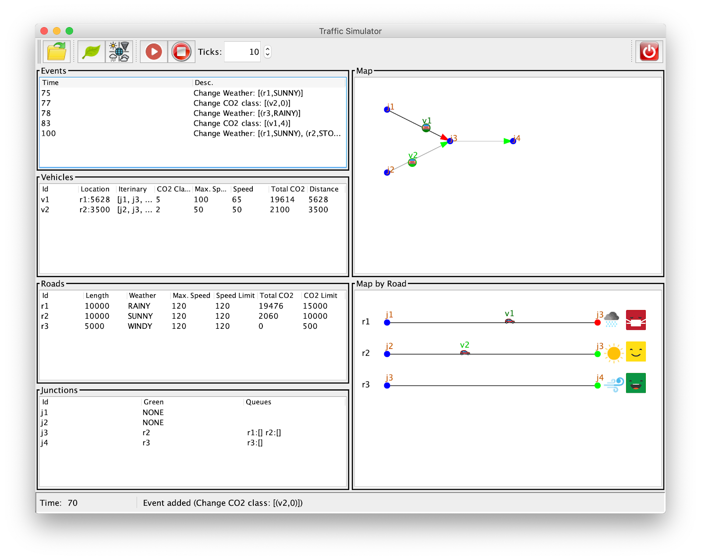
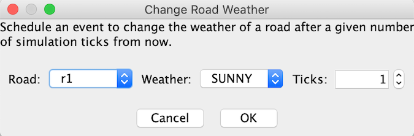

# Práctica 2:  Interfaz gráfica para el simulador de tráfico

**Fecha de entrega**: 22 de abril de 2025 a las 08:30am.

**Demo**: [demo.mp4](./demo.mp4)

# Control de copias

Durante el curso se realizará control de copias de todas las prácticas,
comparando las entregas de todos los grupos de TP2. Se considera copia
la reproducción total o parcial del código de otros alumnos o cualquier
código extraı́do de Internet o de cualquier otra fuente, salvo aquellas
autorizadas explı́citamente por el profesor. En caso de detección de 
copia, la calificación en la convocatoria de TP2 en la que se haya
detectado la copia será `0`.

Si decides almacenar tu código en un repositorio remoto, por ejemplo
en un sistema de control de versiones gratuito con vistas a facilitar
la colaboración con tu compañero de laboratorio, asegúrate de que tu
código no esté al alcance de los motores de búsqueda. Si alguien que
no sea el profesor de tu asignatura, por ejemplo un empleador de una
academia privada, te pide que facilites tu código, debes negarte.

# Instrucciones generales

Las siguientes instrucciones **son estrictas**, es decir, debes seguirlas obligatoriamente.

* Leer el enunciado completo antes de empezar a escribir código.

* Haz una copia de la práctica 1 antes de hacer cambios en ella para la práctica 2.

* Crea un nuevo paquete `simulator.view` para colocar en él todas las clases de la vista. 

* Descarga los archivos [resources.zip](./resources.zip) y [src.zip](./src.zip), descomprímelos y copia su contenido a los directorios correspondientes.
  
* Es necesario usar exactamente la misma estructura de paquetes y los mismos nombres de clases que aparecen en el enunciado.

* **No está permitido** el uso de ninguna herramienta para la generación automática de interfaces gráficas de usuario.

* Te proporcionamos un conjunto de iconos pero si lo prefieres puedes utilizar otros (`resources/icons`).

* Te proporcionamos un ejemplo de una ventana de diálogo (`extra.dialog`).

* Te proporcionamos un ejemplo de `JTable` y `JSpinner` (`extra.jtable`)

* Te proporcionamos la clase `simulator.view.MapComponent.java` para que lo utilices para uno de los visores del mapa de carreteras (se explicará en la sección correspondiente).

* Te proporcionamos un conjunto de ejemplos nuevos (`resources/examples`). Son los mismos que los de la práctica 1, pero han cambiado las coordenadas de los cruces, las longitudes de las carreteras, etc

* Cuando entregues la práctica sube un fichero con el nombre `src.zip` que incluya solo la carpeta `src`. **No está permitido llamarlo con otro nombre ni usar 7zip, rar, etc.** 

# Descripción general de la práctica

En esta práctica vas a desarrollar la interfaz gráfica (GUI) del simulador de tráfico siguiendo el patrón de diseño modelo-vista-controlador (MVC). En la Figura 1 abajo puedes ver la vista general de la GUI. Consta de una ventana con 4 partes principales: 

1. un panel de control para interactuar con el simulador.
2. varias tablas donde se muestra información sobre el simulador.
3. varias componentes para ver la simulación de forma gráfica.
4. una barra de estado donde se muestran algunos mensajes. 

A continuación se explica, en primer lugar, cómo preparar el modelo (y el controlador) para usar el patrón MVC y posteriormente los detalles y requisitos de cada una de las 4 partes.

**Figura 1**: La GUI del simulador de tráfico 



# Preparación del modelo y del controlador para usar MVC

Modifica la clase `TrafficSimulator` para usar MVC. Para ello, define las siguientes interfaces para representar observadores y observables (colócalos en el paquete `simulator.model`):

```java
TrafficSimObserver {
	void onAdvance(RoadMap map, Collection<Event> events, int time);
	void onEventAdded(RoadMap map, Collection<Event> events, Event e, int time);
	void onReset(RoadMap map, Collection<Event> events, int time);
	void onRegister(RoadMap map, Collection<Event> events, int time);
}

public interface Observable<T> {
	void addObserver(T o);
	void removeObserver(T o);
}
```

Modifica la clase `TrafficSimulator` para que implemente la interfaz `Observable<TrafficSimObserver>`. Esto requiere añadir dos métodos para permitir agregar y eliminar observadores. Modifica los diferentes métodos de `TrafficSimulator` para enviar notificaciones, tal y como se describe a continuación:

* `onAdvance` se invoca cuando termina el método `advance` de `TrafficSimulator` avanzando el estado (es decir, al final del método).

* `onEventAdded` se invoca cuando se añade un evento al simulador (después de añadir el evento a la cola). Su tercer parámetro `e` es el evento que se ha añadido a la cola.

* `onReset` se invoca al final del método `reset` (es decir, después de hacer el reset).

* `onRegister` se invoca cuando se registra un observador en la clase TrafficSimulator.

Añade los siguientes métodos a la clase `Controller`:

* `addObserver(TrafficSimObserver o)`: invoca `addObserver` de `TrafficSimulator`

* `removeObserver(TrafficSimObserver o)`: invoca `removeObserver` de `TrafficSimulator`

* `addEvent(Event e)`: invoca addEvent de `TrafficSimulator`

* `run(int n)`: invoca a `advance` de `TrafficSimulator` `n` veces. Es similar a `run(int n, OutputStream out)` pero no escribe nada. 

Añadimos estos métodos para evitar pasar el modelo a las vistas (sólo para simplificar el código).

Después, sobrescribe el método `toString()` en todas las clases de tipo `Event` para que devuelva su descripción. Por ejemplo, para la clase `NewVehicleEvent` puedes utilizar lo siguiente: 

```java
@Override
public String toString() {
	return "New Vehicle '"+_id+"'";
}
````

Ten en cuenta que en algunas clases (carreteras, vehículo y cruce) necesitarás añadir getters **públicos** para consultar información desde la vista. 

# La ventana principal

La ventana principal está representada por la clase llamada `MainWindow` que extiende a la clase  `JFrame`. Para obtener el diseño que se muestra en la Figura 1 puedes usar el siguiente código como punto de partida para construir la GUI (pero no es obligatorio):

```java
public class MainWindow extends JFrame {

	private Controller _ctrl;

	public MainWindow(Controller ctrl) {
		super("Traffic Simulator");
		_ctrl = ctrl;
		initGUI();
	}

	private void initGUI() {
		JPanel mainPanel = new JPanel(new BorderLayout());
		this.setContentPane(mainPanel);

		mainPanel.add(new ControlPanel(_ctrl), BorderLayout.PAGE_START);
		mainPanel.add(new StatusBar(_ctrl),BorderLayout.PAGE_END);
		
		JPanel viewsPanel = new JPanel(new GridLayout(1, 2));
		mainPanel.add(viewsPanel, BorderLayout.CENTER);

		JPanel tablesPanel = new JPanel();
		tablesPanel.setLayout(new BoxLayout(tablesPanel, BoxLayout.Y_AXIS));
		viewsPanel.add(tablesPanel);

		JPanel mapsPanel = new JPanel();
		mapsPanel.setLayout(new BoxLayout(mapsPanel, BoxLayout.Y_AXIS));
		viewsPanel.add(mapsPanel);

		// tables
		JPanel eventsView = createViewPanel(new JTable(new EventsTableModel(_ctrl)), "Events");
		eventsView.setPreferredSize(new Dimension(500, 200));
		tablesPanel.add(eventsView);
		// TODO add other tables
		// ...

		// maps
		JPanel mapView = createViewPanel(new MapComponent(_ctrl), "Map");
		mapView.setPreferredSize(new Dimension(500, 400));
		mapsPanel.add(mapView);
		// TODO add a map for MapByRoadComponent
		// ...
		
		this.setDefaultCloseOperation(DO_NOTHING_ON_CLOSE);
		this.pack();
		this.setVisible(true);
	}

	private JPanel createViewPanel(JComponent c, String title) {
		JPanel p = new JPanel( new BorderLayout() );
            // TODO add a framed border to p with title
		p.add(new JScrollPane(c));
		return p;
	}
}
```

# Panel de control

El panel de control lo implementaremos mediante la clase `ControlPanel` que extiende a `JPanel` e implementa la interface `TrafficSimObserver`. Su constructor tiene como parámetro el controlador. Incluye los siguientes botones:

## Carga del fichero de eventos  

Abre un diálogo para seleccionar un fichero de eventos (utilizando `JFileChooser`). Una vez seleccionado el fichero, primero llama al método `reset` y posteriormente al método `loadEvents` (ambos son métodos del controlador). Si el fichero no existe o `loadEvents` lanza una excepción muestra un diálogo con un mensaje de error.

## Cambio de la clase de contaminación de un vehículo 

Abre una ventana de diálogo donde el usuario puede seleccionar un vehículo  `V`, una clase de contaminación `C` (0-10) y un número de ticks `N`. Si el usuario hace clic en OK debes agregar un evento al simulador para cambiar la clase de contaminación de vehículo `V` a `C` después de `N` ticks desde el momento actual. Para la ventana de diálogo debes implementar la clase `ChangeCO2ClassDialog` que extiende a `JDialog`.


## Cambio de las condiciones atmosféricas de una carretera 

Abre una ventana de diálogo donde el usuario puede seleccionar una carretera `R`, unas condiciones atmosféricas `W`, y un número de ticks `N`. Si el usuario hace clic en OK debes agregar un evento al simulador para cambiar a `W` las condiciones atmosféricas de la carretera seleccionada `R` después de `N` ticks desde el momento actual. Para la ventana de diálogo debes implementar la clase `ChangeWeatherDialog` que extiende a `JDialog`.



## Ejecución, parada y ticks   

Al pulsar el botón RUN se ejecuta el simulador el número de ticks (pasos) indicado en el spinner. Si se pulsa el botón STOP, la simulación se debe detener si está ejecutándose. Todos los botones excepto el de STOP, estarán desactivados durante la ejecución y se reactivarán cuando termine la simulación o sea detenida por el usuario. Para implementar este comportamiento utiliza los siguientes métodos que garantizan que la interfaz no se quede bloqueada y responda a la interacción del usuario durante la simulación (se explicará en clase más detalladamente).

```java
private void run_sim(int n) {
	if (n > 0 && !_stopped) {
		try {
			_ctrl.run(1);
         		SwingUtilities.invokeLater(() -> run_sim(n - 1));
		} catch (Exception e) {
			// TODO show error message
			_stopped = true;
			// TODO enable the toolbar
		}
	} else {
		_stopped = true;
                // TODO enable the toolbar
	}
}
```

## Salida del simulador 

Abre una ventana de diálogo que le solicita al usuario confirmación y después cierra la aplicación usando `System.exit(0)`.

# Barra de estado

La barra de estado la representaremos mediante la clase `StatusBar` que extiende a `JPanel` e implementa `TrafficSimObserver`. En la Figura 1 se puede ver que la barra de estado muestra en su parte izquierda el tiempo actual. Además, cada vez que se añade un evento e se muestra un mensaje (el contenido del mensaje es el que devuelve la llamada `e.toString()`). Si quieres puedes añadir a la barra de estado otros mensajes.

# Tablas de información

En este apartado implementarás las 4 clases que se describen a continuación. Todas extienden a `AbstractTableModel` e implementan `TrafficSimObserver` (el parámetro del constructor es el controlador):

* `EventsTableModel`: la fila i-ésima corresponde al evento i-ésimo de la cola de eventos (de `TrafficSimulator`). La primera columna es el tiempo en el que se ejecuta el evento (se obtiene utilizando su método `getTime`) y la segunda es su descripción (se obtiene utilizando su método `toString`).

* `VehiclesTableModel`:  la fila i-ésima corresponde al vehículo i-ésimo de la lista de vehículos (del mapa de carreteras). Las columnas son: el identificador del vehículo, el estado, el itinerario, la clase de CO2, la velocidad máxima, la velocidad actual, el total de CO2 emitido y la distancia total recorrida. Para mostrar el estado:  si el estado es `PENDING` muestra “Pending”;  si el estado es `TRAVELING` muestra “r1:44” donde r1 es la carretera actual y  45 es la posición; si el estado es  WAITING muestra “Waiting:j1” donde j1 es el cruce en el que está esperando; si el estado es ARRIVED muestra “Arrived”.

* `RoadsTableModel`: la fila i-ésima corresponde a la carretera i-ésima de la lista de carreteras (del mapa de carreteras). Las columnas son: el identificador de la carretera, la longitud, las condiciones climatológicas, la velocidad máxima, la velocidad actual, el CO2 total y el límite de CO2.

* `JunctionsTableModel`: la fila i-ésima corresponde al cruce i-ésimo de la lista de cruces (del mapa de carreteras). Las columnas son: el identificador del cruce, el nombre de la carretera de entrada que tiene el semáforo en verde (NONE si todos están en rojo), y las colas de las carreteras de entrada donde cada cola es de la forma “r1:[v2,v4]” (es decir, la cola de r1 tiene los vehículos v2 y v4).

En todas las tablas se debe utilizar `fireTableStructureChanged()` para notificar a la correspondiente `JTable` que los datos han cambiado. Todas las tablas tendrán una cabecera con los nombres de las columnas. Recuerda que la creación de una tabla en el método `initGUI` de `MainWindow` se hace de la siguiente manera: 

```java
createViewPanel(new JTable(new EventsTableModel(_ctrl)), "Events"); 
```

# Visores del mapa de carreteras

Como se puede ver en la Figura 1, hay dos vistas del mapa de carreteras. La implementación de la vista situada en la parte superior te la proporcionamos `MapComponent.java`. Debes estudiarlo para implementar la vista inferior en la clase `MapByRoadComponent` que extiende a `JComponent` e implementa `TrafficSimObserver` (el constructor recibe el controlador).

Añade al constructor la instrucción `setPreferredSize(new Dimension (300, 200))`. En el método `paintComponent`, debes dibujar primero un fondo blanco y después, para cada carretera, dibujar sus vehículos, sus condiciones atmosféricas y su clase de contaminación. La i-ésima carretera (la primera es la carretera 0) debe dibujarse de la siguiente manera:

* Dibújala como una línea (utilizando `g.drawLine`) desde las coordenadas `(x1,y)` hasta las coordenadas `(x2,y)` donde `x1=50`, `x2=getWidth()-100` y `y=(i+1)*50`. 

* Dibuja en los extremos dos círculos para representar los cruces. El cruce origen de la carretera en color azul y el cruce destino en verde o rojo dependiendo del color del semáforo de la carretera.

* Dibuja los vehículos utilizando la imagen `car.png` (por ejemplo con tamaño 16x16) con el identificador del vehículo encima de la imagen. La coordenada `x` de la imagen se puede calcular de la siguiente manera:

  `x = x1 + (int) ((x2 - x1) * ((double) A / (double) B))` 

  donde `A` es la posición del vehículo y `B` es la longitud de la carretera.

* Dibuja a la izquierda el identificador de la carretera.

* Dibuja una imagen de 32x32 para las condiciones climatológicas de la carretera.

* Dibuja una imagen de 32x32 para el nivel de contaminación. Para calcular dicho nivel utiliza la siguiente fórmula:

   	 `C = (int) Math.floor(Math.min((double) A/(1.0 + (double) B),1.0) / 0.19)`

donde `A` es la contaminación total y `B` es el límite de contaminación de la carretera. Una vez calculado `C` utiliza la imagen `cont_C.png` (es decir, `cont_0.png`, `cont_1.png`, etc.)

# Cambios en la clase Main

1. Añade lo necesario para que la línea de comando tenga la nueva opción `-m` (o bien `--mode`). Tiene dos posibles valores : `gui` o `console` (si no se proporciona el valor por defecto es `gui`). Observa que en modo `gui`: (a) el parámetro `-i` es opcional, es decir, si aparece se carga el fichero de eventos en el simulador pero si no aparece se inicia la simulación sin cargar ningún evento y (b) la opción `-o` se debe ignorar.

2. Crea el método `startGUIMode` y dentro de él, crea el simulador, crea el controlador, carga en el simulador los eventos del fichero de entrada (si se proporciona) y por último crea la ventana principal utilizando el siguiente código: 

```java
SwingUtilities.invokeLater(new Runnable() {	
	@Override
	public void run() {
		new MainWindow(ctrl);
	}
}); 
```


3. Cambia el código del método start para invocar `startBatchMode` o `startGUIMode` dependiendo del valor de la opción `-m`.
