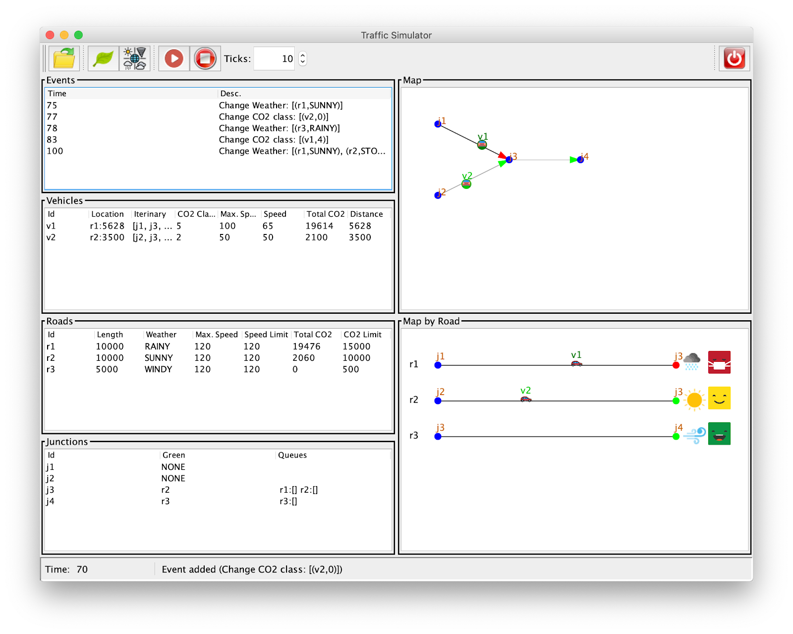
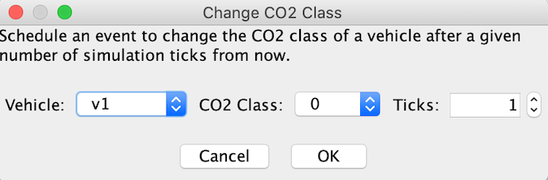
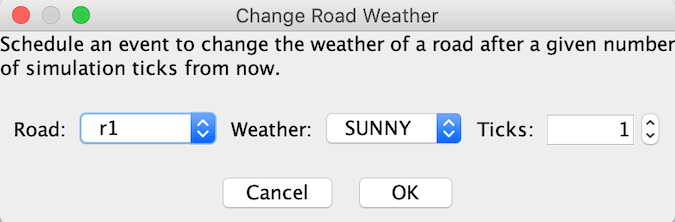
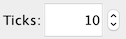

# Assignment 2: Graphical User Interface for the Traffic Simulator

**Due date**: April 22, 2025 at 08:30am.

**Demo**: [demo.mp4](./demo.mp4)

# Copy detection

For each of the TP2 assignments, all the submissions from all the
different TP2 groups will be checked using anti-plagiarism software,
by comparing them all pairwise and by searching to see if any of the
code of any of them is copied from other sources on the Internet
or previous years assignment. Any plagiarism detected will be treated
as a grade of zero for the TP2-course exam session (*convocatoria*) to
which the assignment belongs.

If you decide to store your code in a remote repository, e.g. in a
free version-control system with a view to facilitating collaboration
with your lab partner, make sure your code is not in reach of search
engines. If you are asked to provide your code by anyone other than
your course lecturer, e.g. an employer of a private academy, you must
refuse.

# General instructions

* Read the whole assignment before you start coding.

* Make a copy of your assignment 1 before you make any change for assignment 2.

* Create a new package `simulator.view`, this is where you should place all view classes.

* Download the files [resources.zip](./resources.zip) y [src.zip](./src.zip), uncompress them and copy their content to the appropriate directories.

* You have to strictly follow the package structure and class names that we suggest.

* **You are not allowed** to use any tool for automatically generating GUIs.

* We provide you a set of icons to be used, but you can use others if you prefer (`resources/icons`).

* We provide you with an example of a dialog window (see `extra.jdialog`).

* We provide you with an example for a `JTable` and `JSpinner` (see `extra.jtable`)

* We provide you a class `simulator.view.MapComponent.java` that should be used for one of the map views (see the corresponding section below).

* We provide you a modified set of examples (`resources/examples`). They are the same as those of assignment 1, but changed coordinates of junctions, lengths of roads, etc.

* When you submit your assignment, upload a file with the name `src.zip` that includes only the `src` folder. **You are not allowed to call it by any other name or use 7zip, rar, etc.**. 

# Overview

In this assignment you will develop a graphical user interface (GUI) or the traffic simulator, following the model-view-controller (MVC) design pattern. The overall view of the GUI is depicted below in Figure 1. 
It consists of a window that includes 4 main parts: 

1. A control panel for interacting with the simulator.
2. Several tables where different information about the simulation state is shown.
3. Several components for viewing the simulation state in a graphical way.
4. a status bar where some messages are shown.

In what follows we will first explain how to prepare your model (and controller) to use the MVC pattern, and then explain the details and requirements of each of the 4 parts.

Figure 1: The GUI of the Traffic Simulator 


# Preparing the Model and Controller for using MVC

First you should modify the class `TrafficSimulator` to use the MVC pattern. For this, define the following interfaces to represent observers and observables and place `simulator.model`:

```java
TrafficSimObserver {
	void onAdvance(RoadMap map, Collection<Event> events, int time);
	void onEventAdded(RoadMap map, Collection<Event> events, Event e, int time);
	void onReset(RoadMap map, Collection<Event> events, int time);
	void onRegister(RoadMap map, Collection<Event> events, int time);
}

public interface Observable<T> {
	void addObserver(T o);
	void removeObserver(T o);
}
```

Modify the class `TrafficSimulator` to implement `Observable<TrafficSimObserver>`. This requires adding two **public** methods to allow adding and removing observers. Modify the different methods of `TrafficSimulator` to send corresponding notifications as follows: 

* `onAdvance` is called when the method `advance` of `TrafficSimulator` is done with advancing the state (i.e., at the end of the method).

* `onEventAdded` is called when an event is added to the simulator (after adding the event to the queue). Its 3rd argument `e` is the event that was added to the queue.

* `onReset` is called at the end of the method `reset` (i.e., after doing the reset).

* `onRegister` is called when an observer registers in the class `TrafficSimulator` (only the new observer is notified).

Modify the class `Controller` to include the following **public** methods that simply call the corresponding ones of `TrafficSimulator` (to avoid passing the model to the views, just for simplifying the code, we could pass it as well):

* `addObserver(TrafficSimObserver o)`: calls `addObserver`

* `removeObserver(TrafficSimObserver o)`: calls `removeObserver`

* `addEvent(Event e)`: calls `addEvent`

* `run(int n)`: calls a `advance` of `TrafficSimulator` `n` times. It is similar to `run(int n, OutputStream out)` but does not write anything to a console/file.


Next, modify the method `toString()` of all event classes in order to return a corresponding description. For example, you could use the following for the `NewVehicleEvent` class

```java
@Override
public String toString() {
	return "New Vehicle '"+_id+"'";
}
````

Note that you might need to add **public** getters to some classes (such as roads, vehicles, and junctions) in order to consult corresponding information from the view classes. 

# Main Window

The main window is represented by a class called `MainWindow` that extends `JFrame`. In order to achieve the layout as in Figure 1, you can use the following code as a starting point to construct the GUI (but you do not have to):

```java
public class MainWindow extends JFrame {

	private Controller _ctrl;

	public MainWindow(Controller ctrl) {
		super("Traffic Simulator");
		_ctrl = ctrl;
		initGUI();
	}

	private void initGUI() {
		JPanel mainPanel = new JPanel(new BorderLayout());
		this.setContentPane(mainPanel);

		mainPanel.add(new ControlPanel(_ctrl), BorderLayout.PAGE_START);
		mainPanel.add(new StatusBar(_ctrl),BorderLayout.PAGE_END);
		
		JPanel viewsPanel = new JPanel(new GridLayout(1, 2));
		mainPanel.add(viewsPanel, BorderLayout.CENTER);

		JPanel tablesPanel = new JPanel();
		tablesPanel.setLayout(new BoxLayout(tablesPanel, BoxLayout.Y_AXIS));
		viewsPanel.add(tablesPanel);

		JPanel mapsPanel = new JPanel();
		mapsPanel.setLayout(new BoxLayout(mapsPanel, BoxLayout.Y_AXIS));
		viewsPanel.add(mapsPanel);

		// tables
		JPanel eventsView = createViewPanel(new JTable(new EventsTableModel(_ctrl)), "Events");
		eventsView.setPreferredSize(new Dimension(500, 200));
		tablesPanel.add(eventsView);
		// TODO add other tables
		// ...

		// maps
		JPanel mapView = createViewPanel(new MapComponent(_ctrl), "Map");
		mapView.setPreferredSize(new Dimension(500, 400));
		mapsPanel.add(mapView);
		// TODO add a map for MapByRoadComponent
		// ...
		
		this.setDefaultCloseOperation(DO_NOTHING_ON_CLOSE);
		this.pack();
		this.setVisible(true);
	}

	private JPanel createViewPanel(JComponent c, String title) {
		JPanel p = new JPanel( new BorderLayout() );
                // TODO add a framed border to p with title
		p.add(new JScrollPane(c));
		return p;
	}
}
```

# Control Panel

The control panel is implemented by a class called `ControlPanel` that extends `JPanel` and implements `TrafficSimObserver`. Its constructor receives the controller. It should include the following buttons (with corresponding tooltips).

## Load Events File  

Opens a dialog for selecting an events file (using `JFileChooser`), and once a file is selected it first calls method `reset` and then method `loadEvents` of the controller in order to load the events into the simulator. It should show a dialog with a corresponding error message if the file does not exist or loadEvents throws an exception.

## Change Contamination Class 

Opens a dialog and asks the user to select a vehicle `V`, a contamination class `C` ( 0-10), and a number of ticks `N`. If the user clicks OK, it adds an event to the simulator for changing the contamination class of vehicle `V` to `C` after `N` ticks from the current time. For the dialog window you should implement a class `ChangeCO2ClassDialog` that extends `JDialog`.



## Change Weather  

Opens a dialog and asks the user to select a road `R`, a weather `W`, and a number of ticks `N`. If the user clicks OK, it adds an event to the simulator for changing the weather of the selected road `R` to `W` after `N` ticks from the current time. For the dialog window you should implement a class `ChangeWeatherDialog` that extends `JDialog`.



## Run, Stop and Ticks   

When the RUN button is clicked, it runs the simulator for the number of ticks that appear in the spinner. If the STOP button is clicked, it should stop the simulation if it is running. All buttons except STOP should be disabled during the simulation and enabled again when it is over (or stopped). To implement this behavior use the methods below, they guarantee that the view will not block during the simulation  (more details will be given in class). 

```java
private void run_sim(int n) {
	if (n > 0 && !_stopped) {
		try {
			_ctrl.run(1);
         		SwingUtilities.invokeLater(() -> run_sim(n - 1));
		} catch (Exception e) {
			// TODO show error message
			_stopped = true;
			// TODO enable the toolbar
		}
	} else {
		_stopped = true;
                // TODO enable the toolbar
	}
}
```

## Exit the Simulator 

Opens a dialog window and asks the user to confirm and then executes `System.exit(0)`.

# Status Bar

The status bar is implemented by a class called `StatusBar` that extends JPanel and implements `TrafficSimObserver`. It always shows the current time as shown in Figure 1. In addition, it should show a message (next to the time) when an event e is added using the text returned by `e.toString()`. You can add any other message you want.

# Information Tables

In this part you will implement the following 4 classes that extend `AbstractTableModel` and implement `TrafficSimObserver` (the constructors receive the controller):

* `EventsTableModel`: the ith row corresponds to the ith event in the list of events (of the `TrafficSimulator`). The first column is the event’s execution time (obtained using its method getTime), and the second is its description (obtained using its toString).

* `VehiclesTableModel` the ith row corresponds to the ith vehicle in the list of vehicles (of the road map). The columns are the vehicle's identifier, its status, its itinerary, its CO2 class, its maximum speed, its current speed, its total CO2 emitted and the total distance traveled. For the vehicle's status: if the status is `PENDING` show “Pending”; if the status is `TRAVELING` show “r1:44” r1 is the current road and 45 is the location; if the status is `WAITING` show “Waiting:j1” where j1 is the junction at which it is waiting; and if the status is `ARRIVED` show “Arrived”.

* `RoadsTableModel` the ith row corresponds to the ith road in the list of roads (of the road map). The columns are the road’s identifier, its length, its weather, its maximum speed, its current speed limit, its total CO2, and its CO2 limit.

* `JunctionsTableModel` the ith row corresponds to the ith junction in the list of junctions  (of the road map). The columns are the junction’s identifier, the identifier of the incoming road with green light (NONE if all red), and the queues of its incoming roads where each queue is of the form “r1:[v2,v4]” (queue of r1 has vehicles v2 and v4).

In all tables, use `fireTableStructreChanged()` in order to notify the corresponding JTable that the data has changed. All tables should have a header with the column names. Recall that creating a table in the `initGUI` of MainWindow is done as follow:

```java
createViewPanel(new JTable(new EventsTableModel(_ctrl)), "Events"); 
```

# Map Viewers

As can be seen in Figure 1, there are two map views. The implementation of the upper one  is given to you (`simulator.view.MapComponent`). You should study it in order to implement the lower one as a class `MapByRoadComponent` that extends JComponent and implements `TrafficSimObserver` (the constructor receives the controller). 

Add the instruction `setPreferredSize(new Dimension(300, 200))` to the constructor. In the method `paintComponent` you should first draw a white background, and then draw the roads. The ith road (the first is the 0th road) should be drawn as follows :

* Draw a line (using `g.drawLine`) from coordinate `(x1,y)` to coordinate `(x2,y)` where `x1=50`, `x2=getWidth()-100` and `y=(i+1)*50`. 

* Draw two circles for the junctions in the extremes. The source junction with blue color, and the destination with red or green depending on if the road has a green or red light. 

* Draw the vehicles using the image car.png (e.g., with size 16x16) with the vehicle identifier on top. The `x` coordinate of the image can be calculated as  

  `x = x1 + (int) ((x2 - x1) * ((double) A / (double) B))` 

  where `A` is the vehicle’s location and `B` is the road’s length.

* Draw the identifier of the road to the left.

* Draw an image of size 32x32 for the weather.

* Draw an image of size 32x32 for the contamination level. For this, first calculate the contamination level

   	 `C = (int) Math.floor(Math.min((double) A/(1.0 + (double) B),1.0) / 0.19)`

where `A` is the total CO2 and `B` is the CO2 limit of the road, and then use the image `cont_C.png` (i.e., `cont_0.png`, `cont_1.png`, etc.)

# Changes in the Main class

1. Add support for a new command-line argument `-m` (with long name `--mode`) that takes two possible values: `gui` or `console` (if not provided, the default is “gui”). Note that in `gui` mode: (a) the option `-i` is optional, i.e., if provided we load the events file into the simulator, otherwise we start without loading any event; and (b) option `-o` should be ignored.

2. Create a method `startGUIMode` in which you create the simulator, create the controller, load the events input file into the simulator (if provided), and then create the main window using:

```java
SwingUtilities.invokeLater(new Runnable() {	
	@Override
	public void run() {
		new MainWindow(ctrl);
	}
}); 
```

3. Change the code of the method `start` to call `startBatchMode` or `startGUIMode` depending on the value of  the option `-m`

